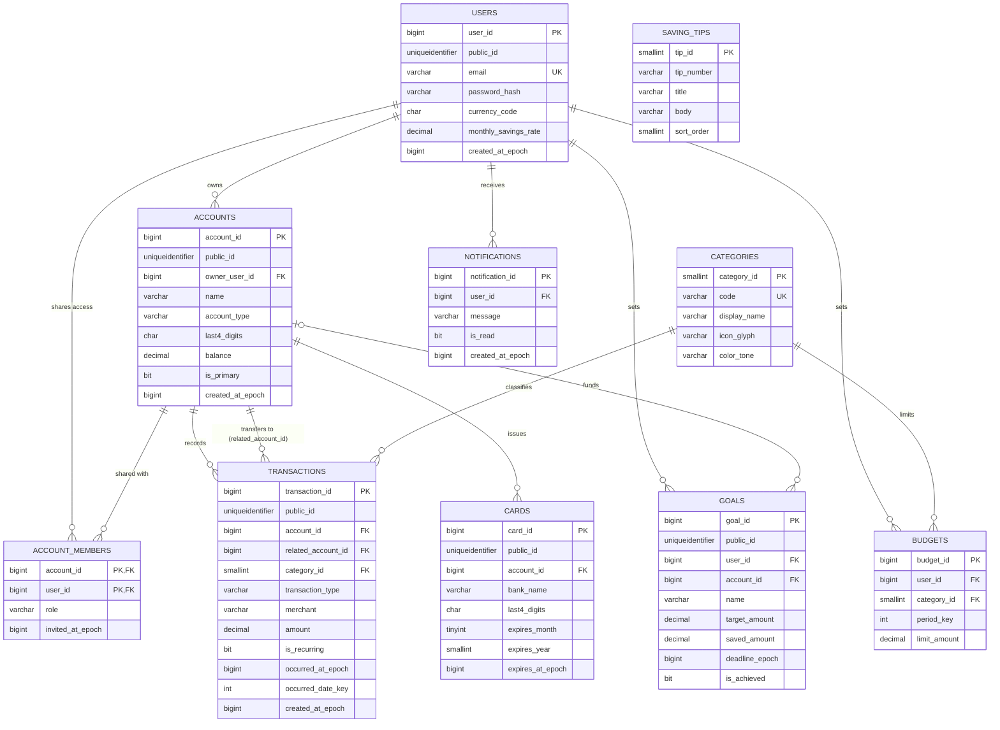

# Arcane Tome — ER Diagram & Table Structure

Derived from the mock UI data in `ArcaneTome.Client` (dashboard, expenses, accounts, summary, settings, saving tips) and `public/mockuser.json`. Target engine: **SQL Server** (matches the .NET/Aspire stack); types translate directly to EF Core.

## Performance conventions used throughout

- **Surrogate keys**: `BIGINT IDENTITY` clustered primary keys for fast joins/inserts; a separate `UNIQUEIDENTIFIER public_id` is exposed on API-facing tables (`users`, `accounts`, `transactions`, `goals`, `cards`, `notifications`) so sequential internal IDs are never leaked externally (avoids IDOR/enumeration).
- **Dates are paired with numeric columns.** Every `*_utc DATETIME2` column that is filtered, sorted, or range-scanned has a companion `*_epoch BIGINT` (Unix seconds, UTC) column. Integer comparisons/index seeks are cheaper than `DATETIME2` comparisons (no calendar math, smaller/faster B-tree keys, no timezone normalization at query time). All hot-path indexes are built on the epoch column, not the `DATETIME2` column.
- **Day-level rollups use a `date_key INT` (YYYYMMDD)**, e.g. `20260325`. This is the classic data-warehouse "date key" trick — it is what powers the UI's day-grouped sections ("Today", "Monday, 23 March 2026") and monthly/period reporting with a plain integer `GROUP BY`/index instead of `DATEPART`/`CONVERT` on every row.
- **Money is `DECIMAL(19,4)`**, never `FLOAT`/`MONEY` — exact arithmetic, no rounding drift. The sign (`+`/`-`) shown in the UI is derived from `transaction_type` at query time; amounts are stored as positive magnitudes so no string parsing is needed for aggregation.
- **Lookup tables** (`categories`, `saving_tips`) use `SMALLINT IDENTITY` — small key width keeps every referencing foreign key (and its index) smaller across millions of transaction rows.
- **Narrow, fixed-width types** for known-length data: `CHAR(3)` for ISO currency codes, `CHAR(4)` for masked card/account last-4 digits, `TINYINT`/`SMALLINT` for months/years/percentages instead of `INT`.

## ER Diagram



## Table structures (DDL)

### `users`
Backs the profile card, `mockuser.json`, and Settings → Profile/Preferences.

```sql
CREATE TABLE users (
    user_id                     BIGINT IDENTITY(1,1) PRIMARY KEY,
    public_id                   UNIQUEIDENTIFIER NOT NULL DEFAULT NEWID(),
    first_name                  VARCHAR(80)      NOT NULL,
    last_name                   VARCHAR(80)      NOT NULL,
    email                       VARCHAR(254)     NOT NULL,
    password_hash               VARBINARY(256)   NOT NULL,      -- Argon2id/bcrypt hash (salt embedded)
    avatar_url                  VARCHAR(512)     NULL,
    currency_code               CHAR(3)          NOT NULL DEFAULT 'CAD',
    monthly_savings_rate        DECIMAL(5,2)     NOT NULL DEFAULT 0,
    weekly_summary_enabled      BIT              NOT NULL DEFAULT 1,
    budget_reminders_enabled    BIT              NOT NULL DEFAULT 1,
    is_active                   BIT              NOT NULL DEFAULT 1,
    created_at_utc              DATETIME2(0)     NOT NULL DEFAULT SYSUTCDATETIME(),
    created_at_epoch            BIGINT           NOT NULL,
    last_login_at_utc           DATETIME2(0)     NULL,
    last_login_at_epoch         BIGINT           NULL,
    CONSTRAINT UQ_users_email UNIQUE (email),
    CONSTRAINT UQ_users_public_id UNIQUE (public_id)
);
CREATE INDEX IX_users_created_at_epoch ON users (created_at_epoch);
```

### `accounts`
Backs Accounts page cards, dashboard balance card, and Add Account modal.

```sql
CREATE TABLE accounts (
    account_id       BIGINT IDENTITY(1,1) PRIMARY KEY,
    public_id        UNIQUEIDENTIFIER NOT NULL DEFAULT NEWID(),
    owner_user_id    BIGINT           NOT NULL,
    name             VARCHAR(120)     NOT NULL,
    account_type     VARCHAR(20)      NOT NULL,   -- 'everyday' | 'savings' | 'goal'
    last4_digits     CHAR(4)          NULL,
    balance          DECIMAL(19,4)    NOT NULL DEFAULT 0,
    currency_code    CHAR(3)          NOT NULL DEFAULT 'CAD',
    icon_glyph       VARCHAR(8)       NULL,
    color_tone       VARCHAR(20)      NULL,
    is_primary       BIT              NOT NULL DEFAULT 0,
    created_at_utc   DATETIME2(0)     NOT NULL DEFAULT SYSUTCDATETIME(),
    created_at_epoch BIGINT           NOT NULL,
    CONSTRAINT FK_accounts_owner FOREIGN KEY (owner_user_id) REFERENCES users (user_id),
    CONSTRAINT CK_accounts_type CHECK (account_type IN ('everyday','savings','goal'))
);
CREATE INDEX IX_accounts_owner_user_id ON accounts (owner_user_id);
```

### `account_members`
Backs the shared-account avatars (M, A, J) and "Add account member" action.

```sql
CREATE TABLE account_members (
    account_id       BIGINT       NOT NULL,
    user_id          BIGINT       NOT NULL,
    role             VARCHAR(20)  NOT NULL DEFAULT 'member',  -- 'owner' | 'member' | 'viewer'
    invited_at_epoch BIGINT       NOT NULL,
    PRIMARY KEY (account_id, user_id),
    CONSTRAINT FK_members_account FOREIGN KEY (account_id) REFERENCES accounts (account_id),
    CONSTRAINT FK_members_user FOREIGN KEY (user_id) REFERENCES users (user_id),
    CONSTRAINT CK_members_role CHECK (role IN ('owner','member','viewer'))
);
```

### `categories`
Lookup table backing expense categories (Grocery, Transport, Housing, Food, Entertainment, Shopping, Vehicle, ...).

```sql
CREATE TABLE categories (
    category_id   SMALLINT IDENTITY(1,1) PRIMARY KEY,
    code          VARCHAR(30)  NOT NULL,
    display_name  VARCHAR(60)  NOT NULL,
    icon_glyph    VARCHAR(8)   NULL,
    color_tone    VARCHAR(20)  NULL,
    sort_order    SMALLINT     NOT NULL DEFAULT 0,
    CONSTRAINT UQ_categories_code UNIQUE (code)
);
```

### `transactions`
Unifies the mock `Transaction` list, dashboard "Recent transactions", and `accountActivity` (deposits/transfers/salary) into a single ledger — the day-grouped sections ("Today", "Monday, 23 March 2026") and category breakdowns are queries against this table, not separate stored tables.

```sql
CREATE TABLE transactions (
    transaction_id       BIGINT IDENTITY(1,1) PRIMARY KEY,
    public_id            UNIQUEIDENTIFIER NOT NULL DEFAULT NEWID(),
    account_id           BIGINT           NOT NULL,
    related_account_id   BIGINT           NULL,        -- set for transfer_type = 'transfer'
    category_id          SMALLINT         NULL,         -- nullable for income/transfer rows
    transaction_type      VARCHAR(10)     NOT NULL,     -- 'income' | 'expense' | 'transfer'
    merchant             VARCHAR(160)     NULL,
    note                 VARCHAR(500)     NULL,
    amount               DECIMAL(19,4)    NOT NULL,     -- stored positive; sign derives from transaction_type
    currency_code        CHAR(3)          NOT NULL DEFAULT 'CAD',
    is_recurring         BIT              NOT NULL DEFAULT 0,
    occurred_at_utc      DATETIME2(0)     NOT NULL,
    occurred_at_epoch    BIGINT           NOT NULL,     -- perf column: numeric range filter/sort
    occurred_date_key    INT              NOT NULL,     -- perf column: YYYYMMDD for day/period rollups
    created_at_utc       DATETIME2(0)     NOT NULL DEFAULT SYSUTCDATETIME(),
    created_at_epoch     BIGINT           NOT NULL,
    CONSTRAINT FK_tx_account FOREIGN KEY (account_id) REFERENCES accounts (account_id),
    CONSTRAINT FK_tx_related_account FOREIGN KEY (related_account_id) REFERENCES accounts (account_id),
    CONSTRAINT FK_tx_category FOREIGN KEY (category_id) REFERENCES categories (category_id),
    CONSTRAINT CK_tx_type CHECK (transaction_type IN ('income','expense','transfer')),
    CONSTRAINT CK_tx_amount CHECK (amount >= 0)
);
CREATE INDEX IX_tx_account_occurred ON transactions (account_id, occurred_at_epoch DESC);
CREATE INDEX IX_tx_category_occurred ON transactions (category_id, occurred_at_epoch DESC);
CREATE INDEX IX_tx_date_key ON transactions (occurred_date_key);
```

### `cards`
Backs the dashboard "Your cards" bank card widget.

```sql
CREATE TABLE cards (
    card_id           BIGINT IDENTITY(1,1) PRIMARY KEY,
    public_id         UNIQUEIDENTIFIER NOT NULL DEFAULT NEWID(),
    account_id        BIGINT           NOT NULL,
    bank_name         VARCHAR(80)      NOT NULL,
    last4_digits      CHAR(4)          NOT NULL,
    card_network      VARCHAR(20)      NULL,
    expires_month     TINYINT          NOT NULL,
    expires_year      SMALLINT         NOT NULL,
    expires_at_epoch  BIGINT           NOT NULL,  -- perf column: "expiring soon" range queries
    is_active         BIT              NOT NULL DEFAULT 1,
    created_at_epoch  BIGINT           NOT NULL,
    CONSTRAINT FK_cards_account FOREIGN KEY (account_id) REFERENCES accounts (account_id),
    CONSTRAINT CK_cards_month CHECK (expires_month BETWEEN 1 AND 12)
);
CREATE INDEX IX_cards_expires_at_epoch ON cards (expires_at_epoch);
```

### `goals`
Backs dashboard "Financial goals" (Buy iPhone 15, Trip to Spain) and the Accounts page "Savings progress" (Rainy day fund goal). Percent-complete is computed as `saved_amount / target_amount` at query time — never stored, to avoid drift.

```sql
CREATE TABLE goals (
    goal_id          BIGINT IDENTITY(1,1) PRIMARY KEY,
    public_id        UNIQUEIDENTIFIER NOT NULL DEFAULT NEWID(),
    user_id          BIGINT           NOT NULL,
    account_id       BIGINT           NULL,        -- optional link to the funding account
    name             VARCHAR(120)     NOT NULL,
    target_amount    DECIMAL(19,4)    NOT NULL,
    saved_amount     DECIMAL(19,4)    NOT NULL DEFAULT 0,
    color_tone       VARCHAR(20)      NULL,
    deadline_utc     DATETIME2(0)     NULL,
    deadline_epoch   BIGINT           NULL,         -- perf column: sort/filter upcoming deadlines
    is_achieved      BIT              NOT NULL DEFAULT 0,
    created_at_epoch BIGINT           NOT NULL,
    CONSTRAINT FK_goals_user FOREIGN KEY (user_id) REFERENCES users (user_id),
    CONSTRAINT FK_goals_account FOREIGN KEY (account_id) REFERENCES accounts (account_id)
);
CREATE INDEX IX_goals_user_deadline ON goals (user_id, deadline_epoch);
```

### `budgets`
Backs the Settings → "Budget reminders" toggle (per-category monthly limits).

```sql
CREATE TABLE budgets (
    budget_id        BIGINT IDENTITY(1,1) PRIMARY KEY,
    user_id          BIGINT       NOT NULL,
    category_id      SMALLINT     NOT NULL,
    period_key       INT          NOT NULL,   -- YYYYMM, e.g. 202603
    limit_amount     DECIMAL(19,4) NOT NULL,
    created_at_epoch BIGINT       NOT NULL,
    CONSTRAINT FK_budgets_user FOREIGN KEY (user_id) REFERENCES users (user_id),
    CONSTRAINT FK_budgets_category FOREIGN KEY (category_id) REFERENCES categories (category_id),
    CONSTRAINT UQ_budgets_period UNIQUE (user_id, category_id, period_key)
);
```

### `saving_tips`
Backs the Saving Tips page content list.

```sql
CREATE TABLE saving_tips (
    tip_id       SMALLINT IDENTITY(1,1) PRIMARY KEY,
    tip_number   VARCHAR(4)   NOT NULL,
    title        VARCHAR(160) NOT NULL,
    body         VARCHAR(600) NOT NULL,
    color_tone   VARCHAR(20)  NULL,
    sort_order   SMALLINT     NOT NULL DEFAULT 0,
    is_active    BIT          NOT NULL DEFAULT 1
);
```

### `notifications`
Backs the sidebar profile notification badge ("4").

```sql
CREATE TABLE notifications (
    notification_id  BIGINT IDENTITY(1,1) PRIMARY KEY,
    user_id          BIGINT       NOT NULL,
    message          VARCHAR(300) NOT NULL,
    is_read          BIT          NOT NULL DEFAULT 0,
    created_at_utc   DATETIME2(0) NOT NULL DEFAULT SYSUTCDATETIME(),
    created_at_epoch BIGINT       NOT NULL,
    CONSTRAINT FK_notifications_user FOREIGN KEY (user_id) REFERENCES users (user_id)
);
CREATE INDEX IX_notifications_user_unread ON notifications (user_id, is_read) INCLUDE (created_at_epoch);
```

## Derived/query-time data (not stored as tables)

- **Spending-by-category breakdown** (`spendingCategories`, "Where your money goes") — `SUM(amount) GROUP BY category_id` over `transactions`, filtered by `occurred_date_key`/`occurred_at_epoch`, with percentage computed against the period total.
- **Daily activity chart bars** (`spendingBars`) — `SUM(amount) GROUP BY occurred_date_key`.
- **Goal progress bar** — `saved_amount / target_amount` computed at read time.
- **Nav items / icons / tones** — static UI configuration, not persisted domain data.
